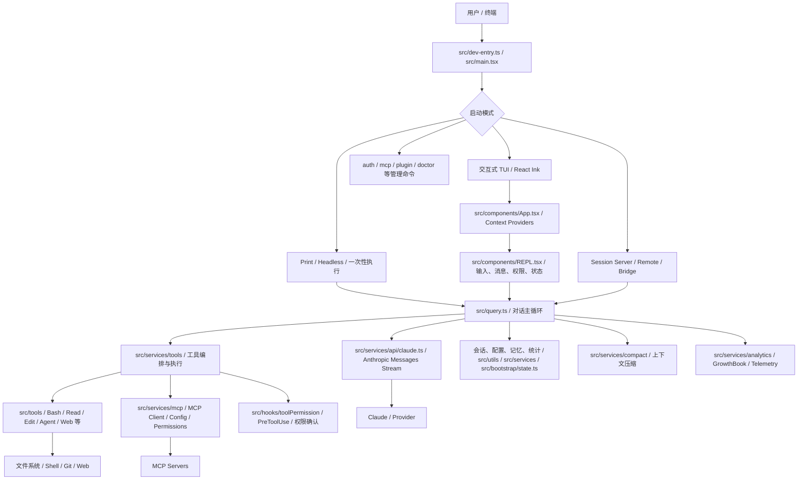
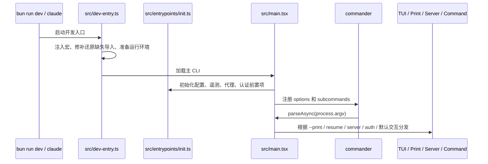
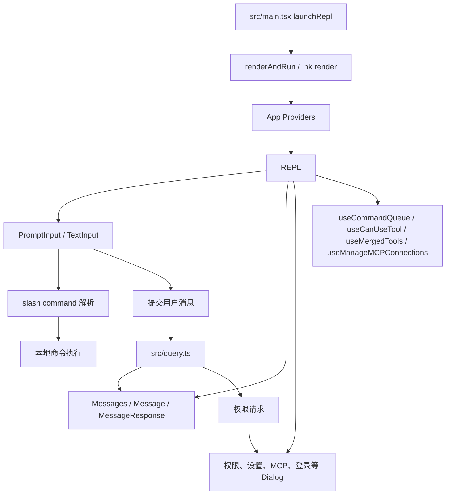
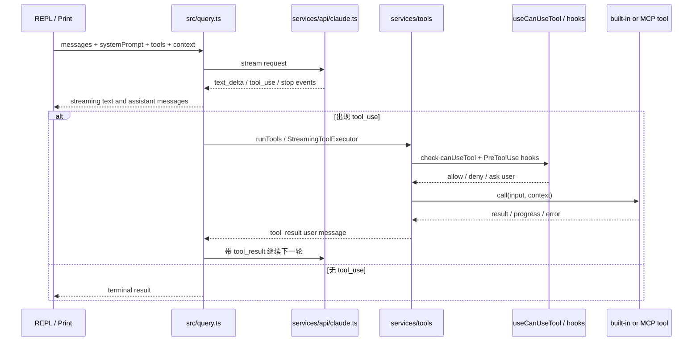
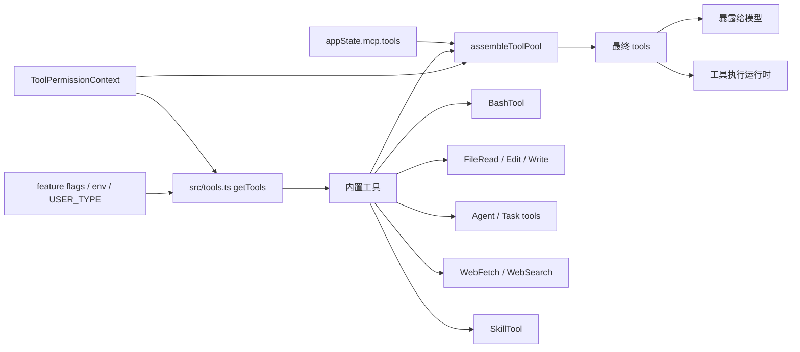
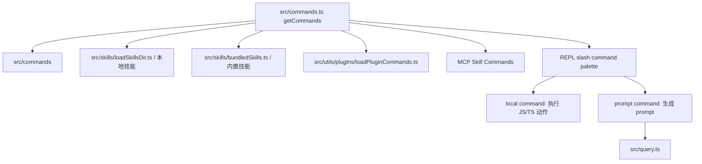
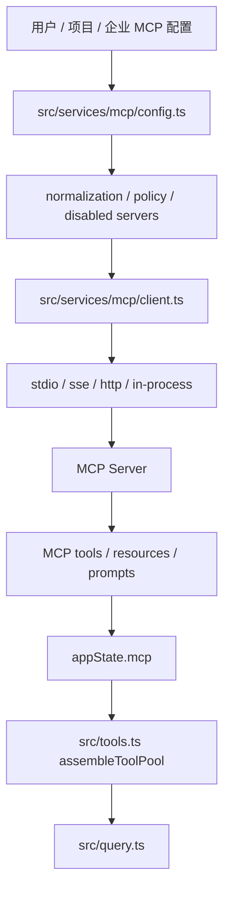
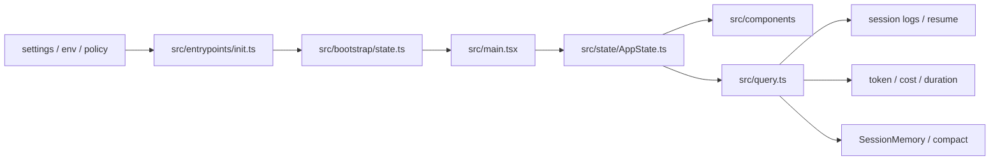
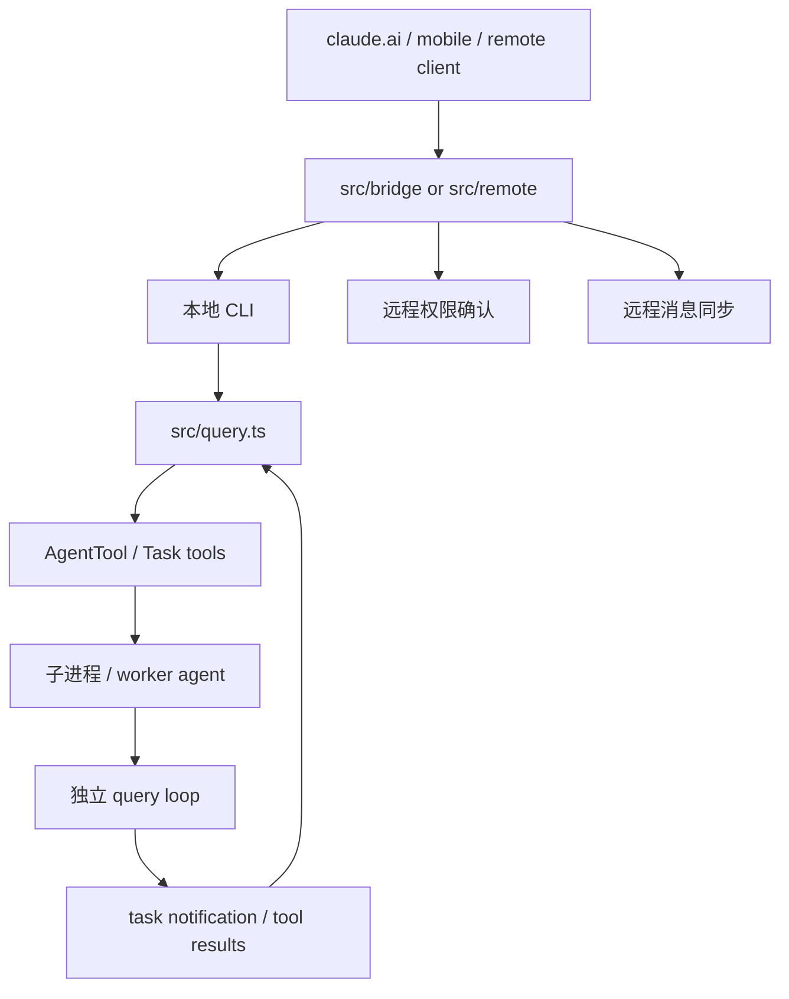

# Claude Code 架构总览

> 目标：用一张总图和几条关键链路，帮助你快速建立这个还原版 Claude Code 的代码地图。本文侧重“怎么跑起来、模块怎么协作”，专题能力细节可继续看 `docs/01-buddy.md` 到 `docs/07-feature-gates.md`。

---

## 一句话架构

这是一个 **Bun + TypeScript + React Ink** 的终端 Agent 应用：`src/main.tsx` 负责 CLI 启动和模式分发，交互式 TUI 由 `src/components/` 与 `src/hooks/` 驱动，模型对话主循环在 `src/query.ts`，工具系统由 `src/Tool.ts`、`src/tools.ts`、`src/tools/`、`src/services/tools/` 组成，外部能力通过 Anthropic API、MCP、IDE、Bridge/Remote 等服务接入。

---

## 目录分层

| 层级 | 主要目录 / 文件 | 职责 |
|---|---|---|
| 启动入口 | `src/dev-entry.ts`、`src/main.tsx`、`src/entrypoints/` | 本地开发入口、Commander CLI、不同运行模式分发 |
| UI/TUI | `src/components/`、`src/hooks/`、`src/ink.ts` | React Ink 终端界面、输入框、消息列表、弹窗、状态栏、快捷键 |
| 对话循环 | `src/query.ts` | 调 Anthropic 流式 API、处理 assistant 消息、发现 tool_use、续跑多轮 |
| 工具抽象 | `src/Tool.ts`、`src/tools.ts`、`src/tools/` | 工具接口、内置工具注册、Bash/文件/Agent/Web/MCP 资源工具等 |
| 工具运行时 | `src/services/tools/` | 工具权限检查、hook、并发/流式执行、结果回填 |
| 命令系统 | `src/commands.ts`、`src/commands/` | slash commands 聚合、动态技能命令、插件命令、内置管理命令 |
| API 服务 | `src/services/api/` | Anthropic SDK 请求、认证、重试、错误转换、用量/配额相关接口 |
| MCP | `src/services/mcp/`、`src/components/mcp/` | MCP 配置读取、连接管理、工具注入、OAuth、权限 relay、UI 管理 |
| 状态与配置 | `src/bootstrap/state.ts`、`src/state/`、`src/utils/config*`、`src/utils/settings/` | 会话 ID、cwd、统计、settings、项目/用户配置 |
| 上下文管理 | `src/services/compact/`、`src/services/contextCollapse/`、`src/services/SessionMemory/` | auto-compact、micro-compact、session memory、上下文预算 |
| 扩展能力 | `src/plugins/`、`src/skills/`、`src/services/plugins/`、`src/services/skillSearch/` | 插件、技能加载、技能搜索、动态命令/工具扩展 |
| 远程/多端 | `src/remote/`、`src/bridge/`、`src/services/api/sessionIngress.ts` | 远程会话、WebSocket/Bridge、远端权限与消息同步 |

---

## 启动链路

开发脚本从 `package.json` 进入 `src/dev-entry.ts`，它做还原树适配和运行时准备，然后加载主 CLI。主入口 `src/main.tsx` 使用 Commander 注册根参数和子命令，并根据参数进入不同模式。

常见路径：

- `bun run dev`：进入默认交互式 TUI。
- `bun run version`：走 `--version` 快速输出版本。
- `claude --print "..."`：跳过完整 TUI，用 headless 方式消费 `query()` 输出。
- `claude server` / `claude open` / remote 相关参数：进入远程 session 或连接模式。
- `claude mcp`、`claude auth`、`claude plugin`：进入管理型子命令，不一定启动 REPL。

---

## 交互式 TUI 结构

`src/components/App.tsx` 是顶层 Provider 壳，向子树注入 AppState、Stats、FPS metrics 等上下文。核心交互集中在 `src/components/REPL.tsx` 及大量 hook：输入、命令队列、工具权限、MCP 连接、IDE 状态、消息渲染、通知等都在这里汇合。

理解 UI 时可以先抓四类文件：

- `src/components/REPL.tsx`：REPL 主容器，连接输入、消息、状态和 query。
- `src/components/PromptInput/`：用户输入与补全体验。
- `src/components/messages/`、`src/components/Message*.tsx`：消息渲染。
- `src/hooks/useCanUseTool.tsx`、`src/hooks/useMergedTools.ts`：权限与工具池进入 UI 的关键点。

---

## 对话与工具调用链路

`src/query.ts` 是最重要的运行时文件。它是一个 async generator：一边向 Anthropic Messages API 发起流式请求，一边 yield 流事件、assistant 消息、工具结果消息和终止状态。只要模型返回 `tool_use`，query loop 就会执行工具，把 tool_result 作为新的 user message 回填，然后继续下一轮，直到没有工具调用或达到终止条件。

关键设计点：

- 工具 schema 由 `toolToAPISchema()` 转给 API，模型只看到当前可用工具池。
- `src/tools.ts` 是内置工具清单和工具池组装的核心，负责合并内置工具与 MCP 工具，并按权限 deny rule 过滤。
- `src/services/tools/toolExecution.ts` 负责单个工具的权限检查、hook、实际调用、错误包装和 telemetry。
- `src/services/tools/StreamingToolExecutor.ts` 支持在模型流式输出中更早启动工具执行，降低等待时间。
- `src/services/compact/` 会在上下文过大或策略触发时压缩历史，然后继续 query loop。

---

## 工具系统

工具接口定义在 `src/Tool.ts`，内置工具实例分布在 `src/tools/*Tool/`。`src/tools.ts` 提供三件事：列出所有可能工具、按运行模式和环境变量过滤、把 MCP 工具与内置工具合并成最终工具池。

从代码阅读角度，工具分三类：

1. **本地能力工具**：Bash、文件读写、Notebook、Git/搜索等，直接操作本机环境。
2. **Agent/任务工具**：`AgentTool`、Task 系列、SendMessage 等，用于子代理、后台任务或多 agent 模式。
3. **外部扩展工具**：MCP 工具、SkillTool、插件带来的命令/技能。

---

## Slash Commands 与插件/技能

`src/commands.ts` 聚合内置 slash commands、动态 skill commands、插件 commands 和 MCP skill commands。命令有本地执行型，也有 prompt 型：本地执行型直接改状态或执行操作；prompt 型会生成一段 prompt 注入当前对话。

命令可用性通常受三层控制：

- 编译期 `feature('...')`：决定代码是否包含。
- 运行时 `USER_TYPE` / 环境变量：区分内部、外部、实验模式。
- GrowthBook 远程开关：动态启停能力或调整策略。

---

## MCP 接入

MCP 是外部工具和资源接入的主要扩展面。配置管理在 `src/services/mcp/config.ts`，连接和 UI 管理在 `src/services/mcp/MCPConnectionManager.tsx`、`src/services/mcp/useManageMCPConnections.ts`，最终 MCP 工具进入 `appState.mcp.tools`，再被 `assembleToolPool()` 合并到工具池。

安全相关点：

- MCP 配置按 scope 合并，支持企业策略过滤和禁用列表。
- MCP 工具也走普通工具权限规则，不是绕过权限系统的特殊通道。
- OAuth、headers helper、channel permission relay 等逻辑都在 `src/services/mcp/` 下独立拆分。

---

## 状态、配置与持久化

项目的状态不是单一 store，而是几类状态源共同工作：

| 状态类型 | 位置 | 说明 |
|---|---|---|
| 进程级运行状态 | `src/bootstrap/state.ts` | sessionId、cwd、累计 token/cost/duration、turn 统计等 |
| React AppState | `src/state/AppState.ts` | TUI 所需状态，如 MCP、模型、权限模式、消息相关状态 |
| 用户/项目 settings | `src/utils/settings/`、`src/utils/config*` | settings.json、环境变量、项目配置、配置来源 |
| 会话记录 | `src/utils/log*`、resume 相关工具 | 对话恢复、日志选择、session title/search 等 |
| 记忆与压缩 | `src/services/SessionMemory/`、`src/services/compact/` | session memory、auto compact、上下文摘要 |
| 遥测与实验 | `src/services/analytics/` | GrowthBook、DataDog、first-party event logging |

---

## 远程、Bridge 与多 Agent 能力

这类能力分布较广，但模式相似：主进程仍然围绕 query loop，只是输入输出和权限通道不再只来自本地终端。

主要阅读入口：

- `docs/04-coordinator.md`：多 Agent 编排模式。
- `docs/06-bridge.md`：远程遥控终端与 Bridge。
- `src/remote/`：remote session 管理、WebSocket 和权限桥。
- `src/tools/AgentTool/`：子 Agent 的创建和运行。

---

## 横切关注点

### 权限与安全

- 工具调用前通过 `CanUseToolFn`、permission context、deny rules 和 hook 共同决策。
- Bash、文件编辑、MCP 工具等高风险能力都进入同一套 tool execution 流程。
- Workspace trust、managed settings security、MCP approval、bypass permissions dialog 等 UI 分布在 `src/components/*Dialog.tsx`。

### Feature Gates

- `feature()` 来自 `bun:bundle`，用于编译期裁剪。
- `USER_TYPE`、环境变量、settings 控制运行时路径。
- GrowthBook 负责远程配置和实验策略。
- 更详细清单见 `docs/07-feature-gates.md`。

### 性能与上下文

- `StreamingToolExecutor` 尝试让工具执行与模型流式输出重叠。
- `services/compact/` 避免上下文无限增长。
- prompt cache、token budget、tool result budget 等逻辑散落在 query、api 和 utils 中。

---

## 新人阅读路线

如果你想系统理解，建议按这个顺序看：

1. `package.json`：确认 Bun 脚本和依赖边界。
2. `src/dev-entry.ts`：理解还原版本地启动适配。
3. `src/main.tsx`：看 CLI 参数、模式分发和 `launchRepl`。
4. `src/components/App.tsx`、`src/components/REPL.tsx`：看交互式 UI 如何组织。
5. `src/query.ts`：重点理解模型请求、流式事件、tool_use 循环。
6. `src/Tool.ts`、`src/tools.ts`、`src/services/tools/toolExecution.ts`：理解工具抽象和权限执行链路。
7. `src/services/api/claude.ts`：理解最终发给 Anthropic API 的请求如何组装。
8. `src/services/mcp/`：理解外部工具如何进入工具池。
9. `docs/05-hidden-commands.md`、`docs/07-feature-gates.md`：理解为什么很多代码路径默认不可见。

---

## 修改代码时的定位建议

| 你要改什么 | 优先看哪里 |
|---|---|
| 新增 slash command | `src/commands/` + `src/commands.ts` |
| 改 TUI 输入体验 | `src/components/PromptInput/`、`src/hooks/useTextInput.ts`、`src/hooks/useInputBuffer.ts` |
| 改消息展示 | `src/components/Messages.tsx`、`src/components/Message*.tsx`、`src/components/messages/` |
| 新增内置工具 | `src/tools/<Name>Tool/`、`src/tools.ts`、`src/Tool.ts` |
| 改工具权限 | `src/hooks/useCanUseTool.tsx`、`src/services/tools/toolExecution.ts`、`src/utils/permissions/` |
| 改 API 请求参数 | `src/services/api/claude.ts`、`src/utils/api.ts` |
| 改 MCP 行为 | `src/services/mcp/`、`src/components/mcp/` |
| 改上下文压缩 | `src/services/compact/`、`src/services/contextCollapse/` |
| 改远程/Bridge | `src/remote/`、`src/bridge/` |
