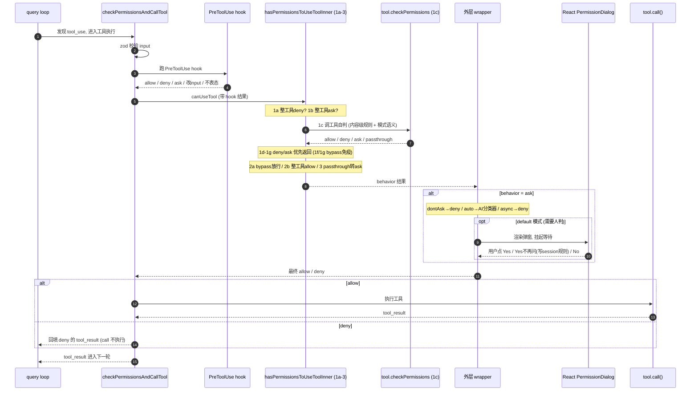

# Claude Code 权限机制

> 学习笔记。工具调用前的权限校验：三层架构、1a-3 决策阶梯、规则来源与配置、hook。
> 核心源码：`src/utils/permissions/permissions.ts`、`src/services/tools/toolExecution.ts`、`src/hooks/useCanUseTool.tsx`、各工具的 `checkPermissions`

---

## 1. 三层架构

权限判定套了三层（由外到内）：

```
useCanUseTool (React 层, hooks/useCanUseTool.tsx)
   └─ hasPermissionsToUseTool (外层包装: dontAsk / auto分类器 / async-deny / denialTracking)
        └─ hasPermissionsToUseToolInner (核心阶梯 1a-3: 纯规则+模式+工具判定)
```

外加 **PreToolUse / PermissionRequest hooks** 在边缘插入。

整条校验发生在工具执行运行时 `checkPermissionsAndCallTool`（`toolExecution.ts`）里，位置在 **PreToolUse hook 之后、`tool.call()` 之前**。不是 React 渲染步骤——React 只在结果是 `ask` 时被拉进来弹窗。

---

## 2. 核心三个概念

- **PermissionMode（模式）**：外部 4 种 `default`(每次问) / `plan`(只读) / `acceptEdits`(自动批编辑) / `bypassPermissions`(全放行)；内部额外 `auto`(AI分类器) / `bubble` / `dontAsk`。
- **PermissionBehavior（三态）**：`allow` / `deny` / `ask`。
- **PermissionRule（规则）**：`{ toolName, ruleContent }`。
  - 整工具级：裸名 `Bash`（无 ruleContent）
  - 内容级：`Bash(git push:*)`、`Edit(src/**)`（带 ruleContent）

---

## 3. 决策阶梯 hasPermissionsToUseToolInner（1a-3）

从上到下短路返回，**越靠上优先级越高，deny 永远赢**：

| 步 | 检查 | 命中 | 谁匹配 |
|----|------|------|--------|
| 1a | 整工具被 deny 规则禁 | deny | 引擎 |
| 1b | 整工具有 ask 规则 | ask（Bash 沙箱命令例外） | 引擎 |
| 1c | 调 `tool.checkPermissions()` | 见 1d-1g | **工具自己** |
| 1d | 工具返回 deny | deny | 工具 |
| 1e | 工具要求强制交互且 ask | ask（bypass 也挡） | 工具 |
| 1f | 内容级 ask 规则（如 `Bash(npm publish:*)`） | ask（**bypass 免疫**） | 工具 |
| 1g | safetyCheck（`.git/`/`.claude/`/shell配置等敏感路径） | ask（**bypass 免疫**） | 工具 |
| 2a | bypassPermissions 模式 | allow | 引擎 |
| 2b | 整工具被 allow 规则允许 | allow | 引擎 |
| 3 | 以上都没命中（passthrough） | 转 ask | 引擎兜底 |

### 三道 bypass 免疫闸（关键安全设计）

1d / 1f / 1g 都在 2a（bypass 放行）**之前**，意味着即使开了 `bypassPermissions` 全放行：

- **1d 工具级 deny**：危险子命令照样拒
- **1f 内容级 ask 规则**：你显式配的 ask 照样问
- **1g safetyCheck**：碰 `.git/`、`.claude/`、shell rc 等敏感路径照样问

「全放行 ≠ 无脑放行」的底线。

---

## 4. 整工具级 vs 内容级匹配（同源不同粒度）

规则只有一份（settings.json `permissions`），但有两种形态，由不同层匹配：

| 形态 | 例子 | 谁匹配 | 阶梯位置 |
|------|------|--------|---------|
| 整工具级（无内容） | `Bash`、`WebFetch` | 通用引擎 `toolMatchesRule` | 1a/1b/2b |
| 内容级（带内容） | `Bash(git push:*)`、`Edit(src/**)` | 工具自己的 `checkPermissions` | 1c |

**为什么拆**：通用引擎看不懂工具特定语义。`Bash(git push:*)` 要匹配 `git push origin main`，得：拆命令 → 取前缀 `git push` → 配 `git push:*`。这套只有 Bash 懂；Edit 是文件 glob，Read 又不同。所以内容级匹配下沉进各工具的 `checkPermissions`。

**「内容」是什么**：工具从 input 参数里提取的关键投影——Bash 取命令前缀，文件工具取 file_path。不是整个参数对象。

---

## 5. 模式处理下沉到工具

模式语义不在主函数判，而在每个工具的 `checkPermissions` 里：

- `bypassPermissions` → 主函数 2a 统一放行
- `acceptEdits` → 工具内部：改工作区文件 `allow`，碰敏感路径返回 safetyCheck `ask`（被 1g 接住）
- `plan` → 工具内部：只读 `allow`，写操作 `deny`
- `default` → 工具返回 `passthrough` → 第 3 步转 `ask`

好处：每个工具懂「自己哪些操作在哪种模式下安全」，主函数只编排优先级。

---

## 6. 外层 wrapper 的后处理（只加工 ask）

内层算完后，外层 `hasPermissionsToUseTool` **只对 `ask` 结果**变换：

- `dontAsk` 模式：ask → deny
- `auto` 模式（TRANSCRIPT_CLASSIFIER）：ask → 交 AI 分类器（yoloClassifier/bashClassifier）判 accept/reject，不弹窗
- async/headless 子 agent（shouldAvoidPermissionPrompts）：ask → deny（弹不了窗就拒）
- denialTracking：auto 模式连续拒绝计数，circuit breaker

**重要**：`allow` 不会被外层改成 ask。想让某操作强制问，要用 **ask 规则（1b/1f）或 hook 在工具出 allow 之前截胡**，靠优先级阶梯而非事后降级。

---

## 7. 规则来源与配置

规则写在 settings.json 的 `permissions` 字段，三态数组：

```jsonc
{
  "permissions": {
    "allow": ["Read", "Glob", "Bash(git status:*)"],
    "deny":  ["WebFetch", "Bash(rm -rf:*)", "Edit(.git/**)"],
    "ask":   ["Bash", "Bash(git push:*)"]
  }
}
```

由 `permissionsLoader` 从多来源加载合并（`getEnabledSettingSources`）：

| 来源 source | 文件 | 谁配 |
|------|------|------|
| policySettings | 企业托管配置 | 管理员/企业（最高，可设 allowManagedPermissionRulesOnly 只认它） |
| userSettings | `~/.claude/settings.json` | 你，跨项目 |
| projectSettings | `.claude/settings.json` | 团队，入库 |
| localSettings | `.claude/settings.local.json` | 你，项目私有（gitignore） |
| cliArg | `--allowedTools` / `--disallowedTools` | 命令行 |
| session | 运行时弹窗点「不再询问」自动写入 | 你点出来的，仅本会话 |
| command | slash command 带的 | 命令 |

配置方式：① 直接编辑 settings.json；② `/permissions` slash command；③ 弹窗点「Yes, and don't ask again」自动写 session 规则。

---

## 8. PreToolUse hook

配在 settings.json 的 `hooks` 字段，结构 `{ 事件名: [ { matcher, hooks: [...] } ] }`：

```jsonc
{
  "hooks": {
    "PreToolUse": [
      {
        "matcher": "Bash",
        "hooks": [
          { "type": "command", "command": "./check.sh", "if": "Bash(git push:*)", "timeout": 10 }
        ]
      }
    ]
  }
}
```

hook 通过 stdout 输出 JSON 回传决定：

```json
{ "permissionDecision": "allow" }
{ "permissionDecision": "deny", "permissionDecisionReason": "禁止 force push" }
```

- 返回 allow/deny → 直接拍板，跳过/覆盖规则阶梯
- 返回 ask 或不表态 → 落回 1a-3
- 还能改写 input（hookUpdatedInput）

hook 在阶梯之前跑，是「可编程的动态钩子」；permissions 规则是「声明式静态规则」。

---

## 9. 时序图：一次权限校验



---

## 10. 优先级总结与设计原则

```
PreToolUse hook
  → deny规则(1a) > 工具ask规则(1b) > 工具自判deny(1d) > 强制交互ask(1e)
  → 内容ask规则(1f, bypass免疫) > safetyCheck(1g, bypass免疫)
  → bypass全放行(2a) > allow规则(2b) > 默认转ask(3)
       ↓ (仅 ask 结果再过外层)
  dontAsk→deny / auto→AI分类器 / async→deny
```

**三条设计原则**：

1. **deny 永远赢**，且 deny / 内容ask / safetyCheck 三道闸 **bypass 免疫**——全放行也守得住敏感边界。
2. **模式判定下沉到工具**——主函数只排优先级，每个工具懂自己的安全语义；危险拦截点（整工具 deny、safetyCheck、hook）不让单个工具实现绕过。
3. **ask 是枢纽**——所有「不确定」汇到 ask，再由模式（default 弹窗 / auto 分类器 / dontAsk 拒 / async 拒）决定怎么消化；allow 一旦产生不被降级。
