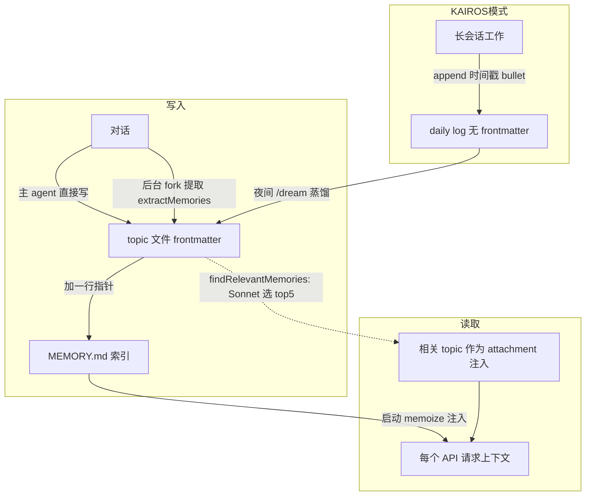

# Claude Code 记忆机制

> 学习笔记。记忆不是一个东西，是 4 套独立系统。重点是 memdir（长期记忆，类 RAG）。
> 核心源码：`src/utils/claudemd.ts`、`src/memdir/`、`src/services/extractMemories/`、`src/services/SessionMemory/`、`src/services/teamMemorySync/`

---

## 0. 四套记忆系统（先定位，别混）

| 系统 | 谁读写 | 生命周期 | 作用域 | 源码 |
|------|--------|---------|--------|------|
| **A. CLAUDE.md** | 人写,模型只读 | 启动注入 | 4 级 hierarchy | `utils/claudemd.ts` |
| **B. memdir 自动记忆** | **模型自读自写** | **跨会话持久(长期)** | 项目级 | `src/memdir/` |
| **C. SessionMemory** | 后台 fork 写 | 单会话(短期) | sessionId 级 | `services/SessionMemory/` |
| **D. Team memory** | 跨成员同步 | 团队 | team scope | `services/teamMemorySync/` |

一句话区分：

```
CLAUDE.md     = 人定的规矩       (静态, 只读, 启动注入)
memdir        = 模型攒的经验     (动态, 自读自写, 跨会话, 长期)
SessionMemory = 这次对话的速记   (后台 fork, 单会话, 服务压缩)
TeamMemory    = 经验的团队共享   (team scope 同步, 防泄密)
```

---

## A. CLAUDE.md（静态指令）

四级 hierarchy（`claudemd.ts:4`）：

| 级别 | 路径 | 作用域 |
|------|------|--------|
| Managed/企业 | `/etc/claude-code/CLAUDE.md` | 所有用户全局 |
| User | `~/.claude/CLAUDE.md` | 个人跨项目 |
| Project | `CLAUDE.md` / `.claude/CLAUDE.md` / `.claude/rules/*.md` | 入库,团队共享 |
| Local | `CLAUDE.local.md` | 个人项目级,不入库 |

- `@import` 语法：`@path` / `@./relative` / `@~/home` / `@/absolute` 引其它文件
- 每次启动加载,进 `userContext`,注入系统上下文
- **人写模型只读**——和 memdir「模型攒的经验」相对

---

## B. memdir 自动记忆（核心，类 RAG）

### B.1 存储结构

目录（按项目 key，跨会话）：`~/.claude/projects/{sanitized-cwd}/memory/`（可被 env/settings 覆盖）

```
memory/
├── MEMORY.md            ← 索引(目录), 只放指针, 常驻注入
├── user_role.md         ← 一条记忆 = 一个主题文件(带 frontmatter)
├── feedback_testing.md
└── project_architecture.md
```

**两种文件，职责严格分开：**

**MEMORY.md = 纯索引（不是记忆本身）**
- 每条一行：`- [Title](file.md) — one-line hook`
- 无 frontmatter，≤200 行/25KB（超了截断）
- 永远不许把记忆正文写进 MEMORY.md

**主题文件 = 真正的记忆（带 frontmatter，`memoryTypes.ts:261`）**
```markdown
---
name: {{记忆名}}
description: {{一行描述 — 检索相关性的依据, 要具体}}
type: {{user | feedback | project | reference}}
---
{{正文 — feedback/project 类结构化: 规则/事实, 然后 **Why:** 和 **How to apply:**}}
```

**4 种 type + scope（`memoryTypes.ts`）：**

| type | 存什么 | scope |
|------|--------|-------|
| user | 用户是谁/角色/目标 | always private |
| feedback | 用户的纠正/偏好 | 默认 private,项目约定才 team |
| project | 项目架构/决策/约定 | 强烈倾向 team |
| reference | 外部资料/链接 | 通常 team |

**核心原则**：只存「从当前项目状态推不出来的」信息。代码模式、架构本身、git history 不存（能现读）。

### B.2 写（提取，两条路径）

**路径 1 — 主 agent 自己写**：对话中用 Write 建主题文件 + Edit MEMORY.md 加指针。

**路径 2 — 后台 fork 提取（`extractMemories.ts`）**：
- 触发：query loop 结束 + 节流
- 机制：`runForkedAgent` fork 主对话,喂「How to save memories」指令 + 现有记忆清单(防重复) + taxonomy
- 游标：`lastMemoryMessageUuid` 标记处理进度,只看新增消息
- 互斥：`hasMemoryWritesSince`——主 agent 这轮写过就跳过后台

**两步写入协议**：① 写 topic 文件(frontmatter) ② 往 MEMORY.md 加一行指针

### B.3 读（使用，两条机制）★关键★

**机制 1：MEMORY.md 索引常驻注入**
启动时 `getMemoryFiles()` 把 MEMORY.md（截断 200 行）注入系统上下文,每个请求都带。模型永远看得到「目录」。

**机制 2：findRelevantMemories 查询时召回（`findRelevantMemories.ts`）**
1. `scanMemoryFiles` 扫所有主题文件的 frontmatter(name + description),只读头部
2. 把 description 清单 + 当前 query 交给 **Sonnet side query**,返回相关文件名(≤5)
3. 选中的主题文件作为 attachment 注入当前轮
4. 排除 MEMORY.md(已常驻);`alreadySurfaced` 去重
5. 智能过滤：正在用的工具的「用法参考」不选,但「坑/警告」仍选

### B.4 召回是语义还是关键词？

**语义召回——但实现是「让 Sonnet 读 description 判断」,不是关键词匹配也不是向量 embedding。**

| 方式 | memdir |
|------|--------|
| 关键词/全文(grep/BM25) | ❌ |
| 向量 embedding + 余弦 | ❌ |
| **LLM 读描述判断相关性** | ✅ |

副作用：LLM 读文本难免受表面关键词重叠影响(假阳性),所以用 recentTools 护栏兜。
`description` 字段是唯一召回信号——写的时候要求「具体」就是为了将来能被召回。

### B.5 两种工作模式（标准 vs KAIROS）

| | 标准模式（默认） | 助手模式（`feature('KAIROS')`） |
|--|--|--|
| 工作时写什么 | 直接写 topic 文件(frontmatter) + 实时更新 MEMORY.md | append 到当天 daily log(无 frontmatter) |
| MEMORY.md 谁维护 | 模型实时维护 | 夜间 /dream 蒸馏维护,模型只读不改 |
| 结构化时机 | 立刻结构化 | 先记流水,夜里蒸馏 |

**daily log**（仅 KAIROS,`paths.ts:246` → `logs/YYYY/MM/YYYY-MM-DD.md`）：
- **不是 frontmatter 文件,没有 type**——是「带时间戳的 bullet,append-only」
- 是蒸馏前的原料;topic 文件(带 frontmatter)是蒸馏后的成品
- MEMORY.md 永远只记指向 topic 文件的指针,**从不记 log**

本质是 **WAL + 后台 compaction**：daily log = 写前日志(快、不打断),夜间 /dream = compaction(整理成结构化 topic + 索引)。长会话场景把整理成本挪到空闲时。

---

## C. SessionMemory（短期/工作记忆）

### 存什么：固定 10 段模板（`prompts.ts:11`）

```
# Session Title          —— 5-10 词高密度标题
# Current State          —— 当前在做什么、待办、下一步(★压缩续接最关键)
# Task specification     —— 用户要建什么、设计决策
# Files and Functions    —— 重要文件、各含什么、为何相关
# Workflow               —— 常跑哪些命令、顺序、输出解读
# Errors & Corrections   —— 踩过的错怎么修、哪些方案别再试
# Codebase and System Documentation —— 系统组件、怎么协作
# Learnings              —— 什么有效/无效/避免
# Key results            —— 用户要的具体产出原样留存
# Worklog                —— 逐步流水账
```

- headers 和斜体说明一字不能动(模板指令),只改说明下面的内容
- 后台 forked agent 用 Edit 并行增量更新,每段限长滚动压缩

### 触发：postSamplingHook + 阈值（不是定时器）

- 注册成 postSamplingHook（`sessionMemory.ts:374`）——每轮模型响应后触发
- `shouldExtractMemory` 查阈值（默认值）：
  - init: 上下文 ≥ 10000 token
  - token 阈值: 距上次涨 ≥ 5000 token（**永远必需**）
  - tool 阈值: 距上次 ≥ 3 次工具调用
  - 触发 = (token AND tool 都达标) OR (token 达标 AND 上轮无工具调用,自然停顿点)
- `sequential()` 防并发;`tengu_session_memory`(默认关)控制

### 短期：按 sessionId 隔离

路径 `~/.claude/projects/{sanitized-cwd}/{sessionId}/session-memory/summary.md`——每会话独立,跨会话不复用(换会话 = 新 sessionId = 空白模板)。落盘但 session 级。

### 和 compact 摘要的关系：SessionMemory = 压缩摘要的「预制版」

`trySessionMemoryCompaction` 在 `compactConversation` 之前先跑：有 SessionMemory 内容就**直接拿它当压缩产物,跳过九段摘要生成**。
- 九段摘要：压缩那一刻临时 LLM 生成(慢、阻塞)
- SessionMemory：平时增量维护好,压缩时直接拿(快)
- 把压缩时的 LLM 开销摊到日常,代价是要持续维护笔记

---

## D. Team Memory Sync

把 `team` scope 的 memory 在团队成员间同步,带 `teamMemSecretGuard` 防把密钥(API key/credentials)同步出去。是 memdir 的团队共享延伸。

---

## 读取时机总结

| 系统 | 何时读 | 读什么 | 注入方式 |
|------|--------|--------|---------|
| A. CLAUDE.md | 启动(memoize) | 4级全部 | userContext,每请求带 |
| B. memdir | 启动(memoize) | **只 MEMORY.md 索引**(截断 200 行) | 同上;topic 文件靠 findRelevantMemories 按需召回 |
| C. SessionMemory | **压缩时** | 对话要点 | trySessionMemoryCompaction 消费,不常驻注入 |
| D. Team memory | 启动(memoize) | team entrypoint | 同 A/B |

- A/B/D 三套走同一条 `getMemoryFiles()` → `userContext.claudeMd`,**启动读一次(memoize),注入每个请求**
- 缓存只在压缩、文件变更等事件失效重读(`resetGetMemoryFilesCache`)
- memdir 只自动读 MEMORY.md 索引;日志/主题文件靠模型 Read 或 findRelevantMemories 按需取

---

## 记忆读写数据流



---

## 设计哲学（三个反复出现的点）

1. **索引/细节分离**：MEMORY.md 当精简索引(限 200 行),细节落 topic 文件按需取——和上下文压缩、子 agent「只回结论」同一套省 token 哲学。
2. **fork 复用主对话**：extractMemories 和 SessionMemory 都用 `runForkedAgent` 共享 prompt cache,后台干活不烧额外大 token。
3. **能用 LLM 判就用 LLM 判**：memdir 召回用 Sonnet 读描述选(而非维护 embedding 索引),和 auto 模式权限分类器、压缩摘要一脉相承——拿一次小 LLM 调用换语义理解,省掉额外基础设施。
